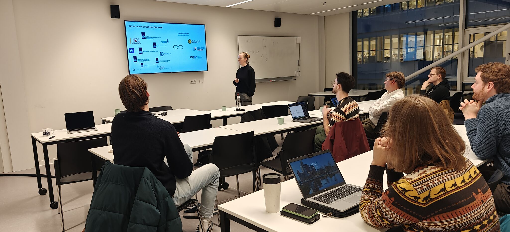

---
date:
  created: 2025-11-28
categories:
  - events
authors:
  - dgraus
title: Joint PhD Meetup with AI Lab voor de Publieke Diensten
description: The OpenGov Lab hosted colleagues from Utrecht University's AI Lab voor de Publieke Diensten at LAB42 for a collaborative PhD meetup, exploring shared research interests and planning future collaboration.
image: phd-meetup-ailab-2025.jpg
---

# Joint PhD Meetup with AI Lab voor de Publieke Diensten

We hosted colleagues from the [AI Lab voor de Publieke Diensten](https://www.uu.nl/onderzoek/ai-labs/ai-lab-voor-de-publieke-diensten) (Utrecht University) at **LAB42 UvA** for a joint PhD meetup.

**David Graus** kicked off with an overview of the ICAI OpenGov Lab, followed by **Maik Larooij** and **Lisa Winters**, who presented their first projects and work packages. **Iris Beerepoot**, lab coordinator of the AI Lab voor de Publieke Diensten, then gave a helicopter overview of the Utrecht lab, their focus areas and stakeholders. Throughout the session, **Guido Ongena** (Hogeschool Utrecht) contributed thoughtful reflections from an information management perspective.

{ loading=lazy }

<!-- more -->

It quickly became clear that we're working on closely related questions from slightly different, but complementary angles. Bringing these perspectives together is useful—not only for our PhD researchers, but also in how we position ourselves towards government, and clarify who we are and what we each bring.

We closed the afternoon with concrete agreements on a follow-up, and a shared sense that collaboration here is simply sensible. Looking forward to the next steps!
