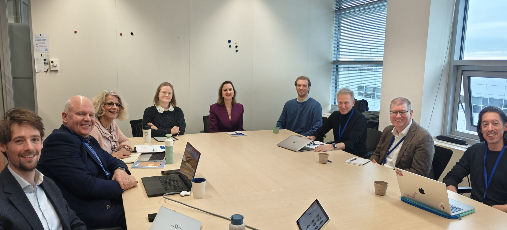

---
date:
  created: 2025-12-04
categories:
  - events
authors:
  - dgraus
title: OpenGov Lab Governing Board Meeting at RvIHH
description: The ICAI OpenGov Lab held its Governing Board meeting at RvIHH in The Hague, followed by a PhD session with project updates from our researchers.
image: gov-board-rvihh-2025.jpg
---

# OpenGov Lab Governing Board Meeting at RvIHH

This week we met at the [Rijksorganisatie voor Informatiehuishouding (RvIHH)](https://www.rvihh.nl/) in The Hague for the **ICAI OpenGov Lab Governing Board** meeting. With GB members **Marion Hermans-Koelemij** (RvIHH) and **Peter van der Donk** (Universiteit van Amsterdam) we discussed progress, collaboration, and plans for the coming year.

{ loading=lazy }

<!-- more -->

After the meeting we continued with our PhD session, where **Sander Verhoeckx** gave an update on the RvIHH Campus, followed by individual project updates from our OpenGov PhD students: **Lisa Winters**, **Patricia Moeskops**, and **Maik Larooij** (Damiaan Reijnaers unfortunately couldn't make it). With **Jaap Kamps** and **David Graus** ([ILLC](https://www.illc.uva.nl/) - University of Amsterdam) and **Paul van den Akker** (I-Partnerschap).

It was great to see the work taking shape, and to align with our partners across the lab and RvIHH. Looking forward to the next steps.
