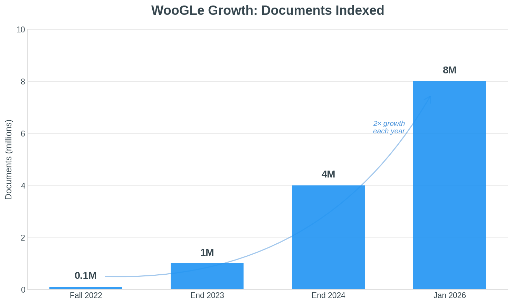

---
date:
  created: 2026-01-08
authors:
  - dgraus
categories:
  - woogle
title: "WooGLe keeps growing: 8 million documents!"
description: WooGLe has doubled in size in 2025, now indexing over **8 million documents** across more than 90,000 dossiers from nearly 800 government bodies
image: woogle-growth-chart.png
---

# WooGLe keeps growing: 8 million documents!

Every year around Christmas, we take stock of WooGLe's growth. And once again, the most recent numbers are remarkable: WooGLe has doubled in size, now indexing over **8 million documents** across more than 90,000 dossiers from nearly 800 government bodies! Maarten Marx has written an [extensive blog](https://wooverheid.nl/2026/01/07/woogle-blijft-exponentieel-groeien/) about this on Wooverheid (Dutch). Read the summary below! 

*WooGLe's document count has doubled each year since launch*

<!-- more -->

## What we added in 2025

We set out to add three new types of information last year, and we did:

- **Court decisions** from rechtspraak.nl (870,000 rulings, updated daily) plus all legislation from wetten.overheid.nl
- **Historical parliamentary records** from goetgevonden.nl—over 500,000 resolutions of the States General from 1576–1796. Combined with contemporary records, you can now search Dutch parliamentary proceedings spanning more than four centuries from one place!
- **Municipal council documents** via openraadsinformatie.nl—millions of agendas and meeting documents from municipalities, provinces, and waterschappen

## Plans for 2026

This year, we're shifting focus from quantity to quality. We want to use AI and LLMs to enrich the documents we already have for extracting structured metadata like "how long did this Woo request take to process?" or "who signed this agreement?"

We're also planning to add _Kamerstukken_ (parliamentary documents beyond the Handelingen), enriched _beschikkingen_ (permit decisions with their underlying requests), and _raadsverslagen_ (linking council agendas to actual decisions and discussions). And we're looking to connect directly to _Dimpact_ through their Woo-API.

## Why this matters

WooGLe has always been about proving a point: that a **unified search facility for all Woo information** is not only useful but entirely feasible. The key ingredient? Government bodies providing data in a standardized format—which is exactly what many of them want to do!

Government doesn't need to build everything itself. With good APIs and FAIR data publication (as required under Article 2.4.3 of the Woo), third parties—researchers, journalists, democracy watchdogs, all can build their own tools. A great example: Bert Hubert's [search system](https://berthub.eu/tkconv/) built on top of the Tweede Kamer API. WooGLe has been calling for this approach since [a 2022 ESB article](https://esb.nu/openbaarheid-van-bestuur-kan-vrijwel-kosteloos-beter/), and will keep making the case.

## One change: Sunsetting hosting service

Back in 2022, WooGLe offered a simple upload service for government bodies struggling to publish their Woo dossiers online. This was always meant as a temporary solution. In 2026, WooGLe is discontinuing its service and helping organizations transition to professional platforms like iBabs, NotuBiz, or Dimpact.

---

Want to explore WooGLe? Check out [woogle.wooverheid.nl](https://woogle.wooverheid.nl) or the [overview page](https://woogle.wooverheid.nl/overview) for current stats!

Update: It is now also possible to curate and export your own WooGLe dataset! Read all about it in our new blog post: [Curate your own WooGLe dataset!](https://opengovlab.org/blog/2026/01/15/curate-your-own-woogle-dataset/).
