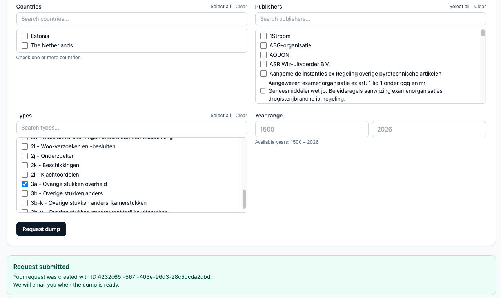

---
date:
  created: 2026-01-15
authors:
  - mlarooij
categories:
  - woogle
title: "Curate and export your own WooGLe dataset!"
description: It is now possible to curate and export your own WooGLe dataset!
image: datadump.png
---

# Curate and export your own WooGLe dataset!

More WooGLe news: next to WooGLe doubling in size last year, it is now also possible to curate and [export your very own WooGLe dataset](https://dump.wooverheid.nl)!

Simply choose which countries, government bodies, years and dossier types (Woo-categories) you want, and download a ZIP file with all matching documents and metadata in JSON format. Perfect for researchers, journalists, or anyone wanting to do large-scale analysis of Woo documents. 

<!-- more -->

## How to use the WooGLe dump service

The dump service is available at [dump.wooverheid.nl](https://dump.wooverheid.nl). You can select the countries, government bodies, years and dossier types you want to include in your dataset. After submitting your request, the system will prepare the dataset and send you an email with a download link when it's ready. Depending on the size of your request, this may take a while. Just sit back, relax and F5 your inbox!

You can use our [metadata schema documentation](https://github.com/wooverheid/WoogleDocumentatie/tree/master/SPEC%20MetadataSchema) to understand the metadata of the JSON files in the dump.

## What's in the dump?

The dump contains metadata and bodytext of all dossiers and corresponding documents matching your criteria. The metadata is provided in JSON format, with one file per dossier. Each dossier file contains metadata on the dossier and an array of documents, each with its own metadata and bodytext. 

Curious? Check out this [example of all decisions on Woo-requests from the Ministry of Economic Affairs](example_dump.zip)!

We try our best to make sure that everything works as expected, but if you run into any issues or have suggestions for improvement, please let us know by emailing [infowooverheid@gmail.com](mailto:infowooverheid@gmail.com).
