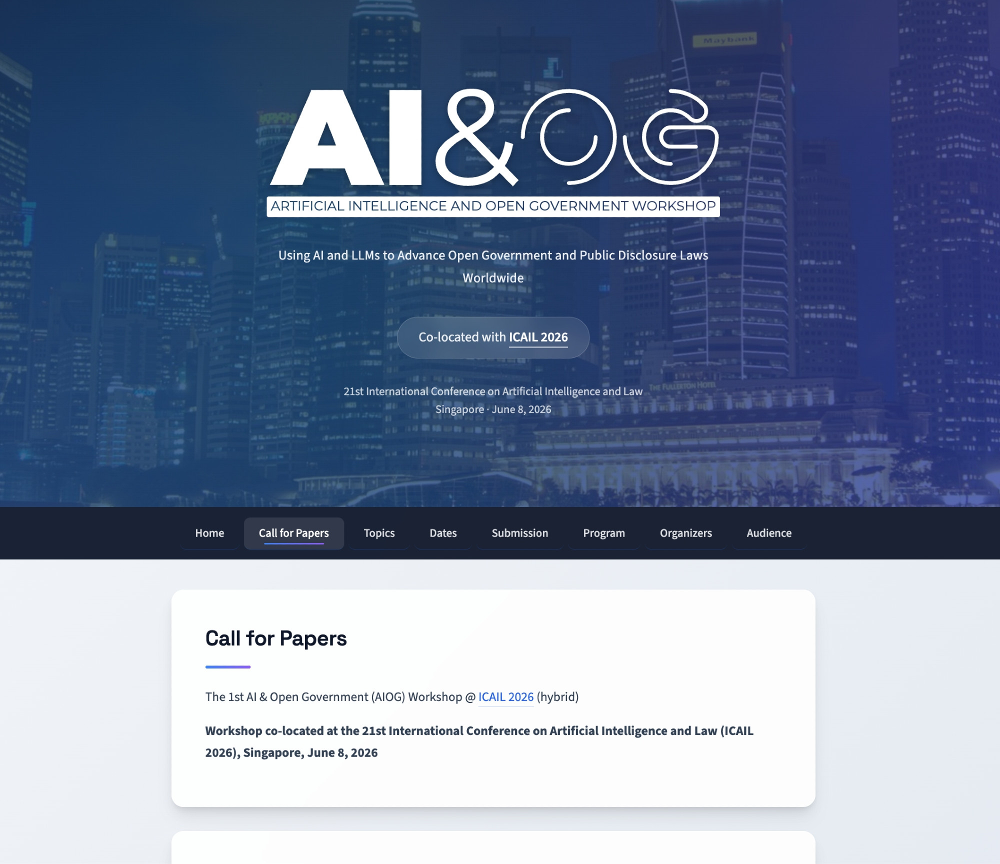

---
date:
  created: 2026-02-23
authors:
  - dgraus
categories:
  - aiog
title: "Call for Papers: AI & Open Government Workshop at ICAIL 2026"
description: We're organizing the 1st AI & Open Government Workshop (AIOG), co-located with ICAIL 2026 in Singapore on June 8, 2026. The call for papers is now open!
image: 210e9353-d56e-4bb5-9c66-77cb690e256b.jpg
---

# Call for Papers: AI & Open Government Workshop at ICAIL 2026

We're excited to announce the **1st AI & Open Government Workshop (AIOG)**, co-located with [ICAIL 2026](https://site.smu.edu.sg/icail-2026) in Singapore on **June 8, 2026**. The call for papers is now open!

The workshop is co-organized by [David Graus](https://opengov.nl) (University of Amsterdam & ICAI OpenGov Lab), [Graham McDonald](https://www.gla.ac.uk/schools/computing/staff/grahammcdonald/) (University of Glasgow), and [Jason R. Baron](https://ischool.umd.edu/directory/jason-r-baron/) (University of Maryland). David initiated the workshop out of the OpenGov Lab's mission to connect the communities working at the intersection of AI and government transparency — spanning information retrieval, legal AI, NLP, e-discovery, and open government practice — who don't always meet at the same conferences.

<!-- more -->

## Why this workshop?

Governments worldwide are grappling with the challenge of making public information accessible and transparent at scale. Whether it's processing freedom of information requests, reviewing documents for sensitive content before publication, or making government archives searchable — AI has a growing role to play. At the same time, this raises important questions about reliability, fairness, and accountability.

AIOG aims to be a space where these challenges can be discussed across disciplinary boundaries, bringing together IR researchers, legal tech practitioners, government professionals, and transparency advocates.

The workshop addresses two key perspectives: **AI for citizens** — tools and techniques for improving search, exploration, and understanding of public government information — and **AI for governments** — assisting in accessibility, pre-processing, metadata enrichment, retrieval, filtering, and protecting sensitive information consistent with public disclosure laws.

## Topics of interest

We welcome submissions on topics including, but not limited to:

- AI-augmented search, retrieval, and summarization for public records
- Technology-assisted review for FOIA and records access requests
- Automated sensitivity review and redaction under FOIA/GDPR
- Metadata enrichment and entity extraction for government record discovery
- Multimodal processing of scans, PDFs, and legacy document formats in public archives
- Agentic AI for FOIA request triage and handling
- Public-facing tools for navigating heterogeneous government data repositories
- Formalising legal standards for disclosure, exemptions, and harm in AI-assisted access workflows
- Governance, auditability, and explainability of AI-assisted disclosure
- RAG architectures and generative AI for public government records and cultural heritage archives
- AI-assisted declassification of government records for public release

## Submission details

We invite two types of submissions:

- **Research papers** (3–9 pages + references): original research contributions
- **Position papers** (up to 5 pages + references): insights from practice

Papers must follow the ACM sigconf template and will be reviewed double-blind. Accepted papers will be published in OpenReview proceedings, and authors will be invited to present their work in person (the workshop is hybrid).

Submit via [submit.aiog.net](https://submit.aiog.net).

## Important dates

- **Submission deadline:** April 9, 2026
- **Notification of acceptance:** May 1, 2026
- **Camera-ready deadline:** May 20, 2026
- **Workshop:** June 8, 2026

All deadlines are 23:59 AoE (Anywhere on Earth).

## Get involved

For full details, visit [aiog.net/cfp](https://aiog.net/cfp/) or get in touch at [d.p.graus@uva.nl](mailto:d.p.graus@uva.nl). You can also follow us on [Bluesky](https://bsky.app/profile/aiog.net).

We hope to see you in Singapore!
