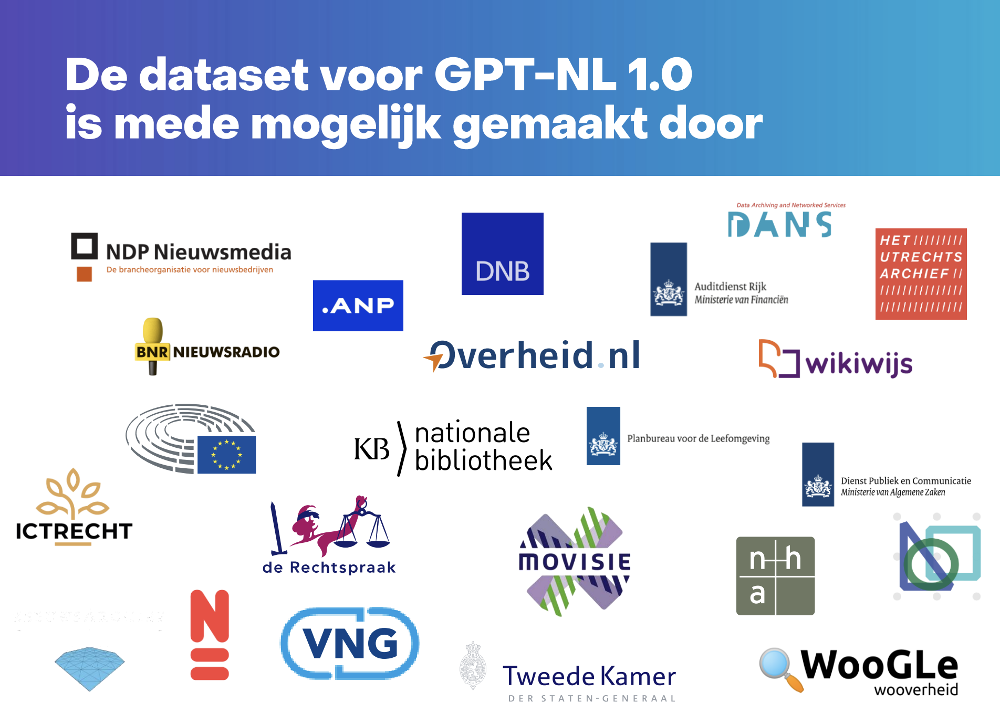

---
date:
  created: 2026-03-04
authors:
  - mlarooij
categories:
  - woogle
title: OpenGov Lab data as a source for training GPT-NL
description: The OpenGov Lab's Woogle dataset was used as a source for training GPT-NL, a large language model focused on Dutch language.
image: woogle-source-for-gptnl.png
---

# OpenGov Lab data as a source for training GPT-NL

The OpenGov Lab's WooZM (former WooGLe) dataset was used as a source for training [GPT-NL](https://gpt-nl.nl/), a large language model focused on Dutch language. The Woogle dataset, which contains millions of documents and metadata from the Dutch government, provided a rich and diverse source of text for training GPT-NL. 

*There we are, at the bottom right corner!*

<!-- more -->

GPT-NL recently received the Dutch Privacy Award because it is the first LLM worldwide that demonstrably complies with the GDPR by design: all personal data in the training data was removed, and there is full transparancy about the training data. 

GPT-NL version 1.0, developed by TNO, will now be used for five 'feasability studies' in the public sector, for example a municipal chatbot and an assistant that answers questions based on overheid.nl. We are proud to have contributed to the training of GPT-NL, and we look forward to seeing how it will be used in the public sector and hopefully enables researchers to investigate and build on top of the GPT-NL model.

