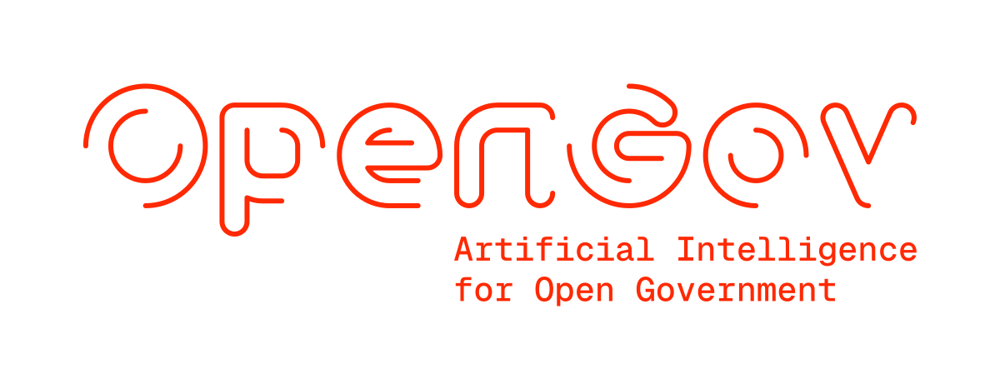

<section class="band band--alt hero" markdown>
  

  

</section>

<section class="band" markdown>
  

Government transparency is central in a democratic society, and increasingly, governments at all levels must publish data proactively and passively (e.g., through FOIA requests).

The lab's mission is to improve and support interpretation, retrieval, and use of open government data, to increase government transparency, public trust, and ultimately democratic participation. By collaborating with the government, researchers, journalists, and citizens, we address the entire information lifecycle: from data creation and disclosure (supply) to its responsible use and societal impact (demand).

Our research helps improve information culture and practices within government, and empowers citizens to engage more effectively in public discourse and decision-making.

[:fontawesome-solid-flask: Our mission](about.md#Mission){ .md-button .md-button--primary }

  

</section>

<section class="band band--alt partners" markdown>
  

## Partners

  

</section>

<section class="band team" markdown>
  

## Team

  

  

[:fontawesome-solid-people-group: Meet the team](team.md){ .md-button }

  

</section>

<section class="band contact band--alt" markdown>
  

## Contact

Get in touch with us at:

- :fontawesome-solid-envelope: [info@opengov.nl](mailto:info@opengov.nl)
- :fontawesome-brands-square-linkedin: [LinkedIn](https://www.linkedin.com/company/opengov-lab/)
- :fontawesome-brands-bluesky: [Bluesky](https://bsky.app/profile/opengov.nl)
- :simple-github: [GitHub](https://github.com/opengov-lab)

[:fontawesome-solid-location-dot: Visit our lab](contact.md){ .md-button }

  

</section>

