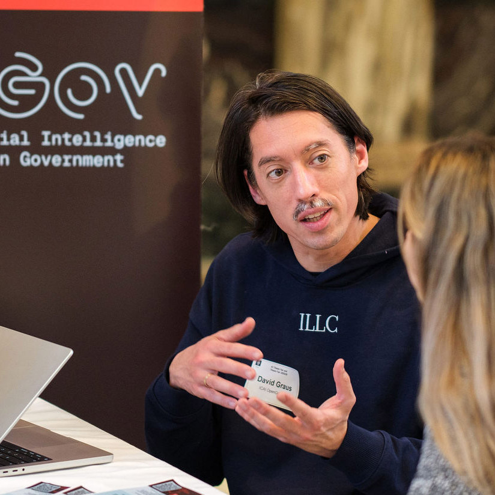
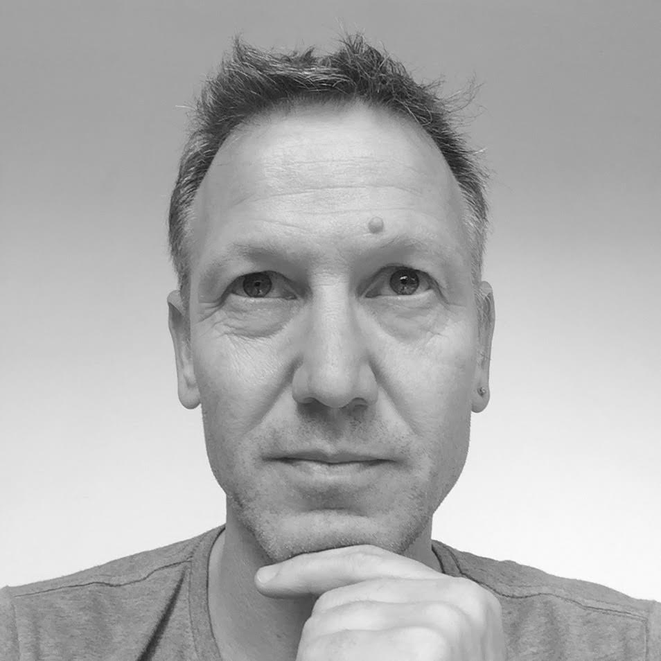
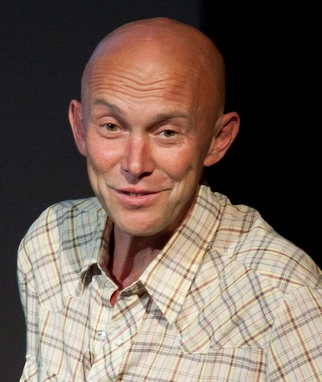
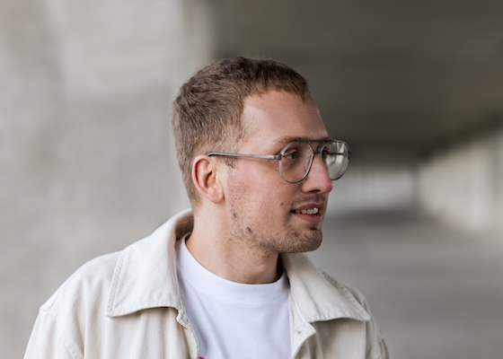
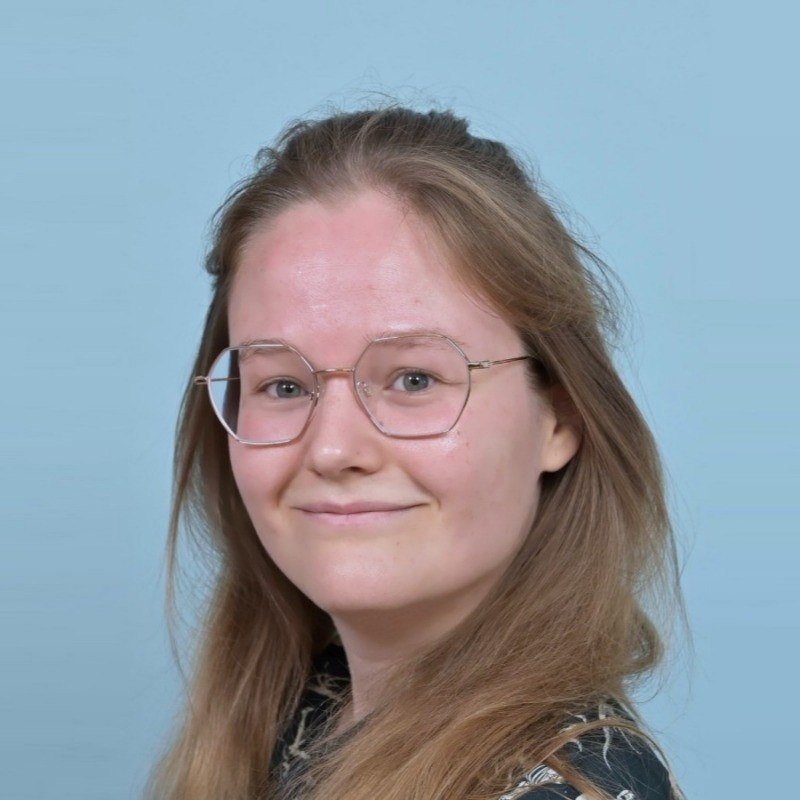

<section class="team-member" markdown>

## David Graus

Lab Manager  
[graus@opengov.nl](mailto:graus@opengov.nl)  
[graus.nu](https://graus.nu)

I’m an assistant professor in Information Retrieval and Natural Language Processing at ILLC, University of Amsterdam, and Lab Manager of the AI for Open Government ICAI Lab.

</section>

<section class="team-member" markdown>

## Jaap Kamps

Lab Co-Director  
[kamps@opengov.nl](mailto:kamps@opengov.nl)  
[e.humanities.uva.nl](https://e.humanities.uva.nl)

I am associate professor of Information Retrieval at the Faculty of Humanities. My research is part of the Institute for Logic, Language, and Computation. Both are part of the University of Amsterdam.

</section>

<section class="team-member" markdown>

## Maarten Marx

Lab Co-Director  
[marx@opengov.nl](mailto:marx@opengov.nl)

I am an assistant professor at the IRLab at the University of Amsterdam.

</section>

<section class="team-member" markdown>

## Maik Larooij

PhD Student  
[larooij@opengov.nl](mailto:larooij@opengov.nl)  
[maiklarooij.nl](https://maiklarooij.nl)

I'm a PhD candidate at the ICAI OpenGov Lab, focusing on advanced IR for open government. 

</section>

<section class="team-member" markdown>

## Damiaan Reijnaers

PhD Student  
[reijnaers@opengov.nl](mailto:reijnaers@opengov.nl)  
[damiaan.nl](https://damiaan.nl)

I'm a PhD candidate at the ICAI OpenGov Lab, focusing on explainable document representations. 

</section>

<section class="team-member" markdown>

## Lisa Winters

PhD Student  
[winters@opengov.nl](mailto:winters@opengov.nl)

I'm a PhD candidate at the ICAI OpenGov Lab, focusing on the information culture gap between government and citizens.

</section>

<section class="team-member" markdown onclick="window.location.href='/team/patricia-moeskops'">

## Patricia Moeskops
PhD Student  
[moeskops@opengov.nl](mailto:moeskops@opengov.nl)

I'm a PhD candidate at the ICAI OpenGov Lab, focusing on desinformation and authoritativeness of open government data.

</section>